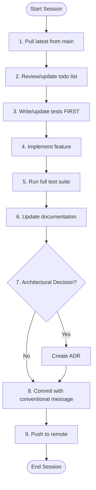
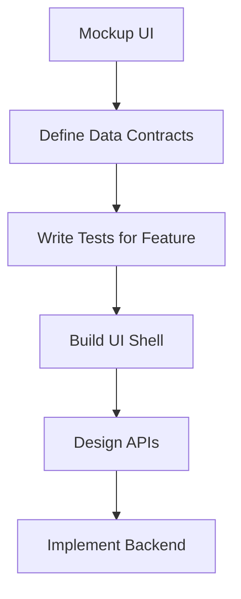
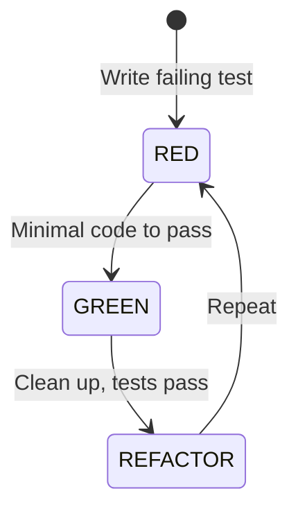
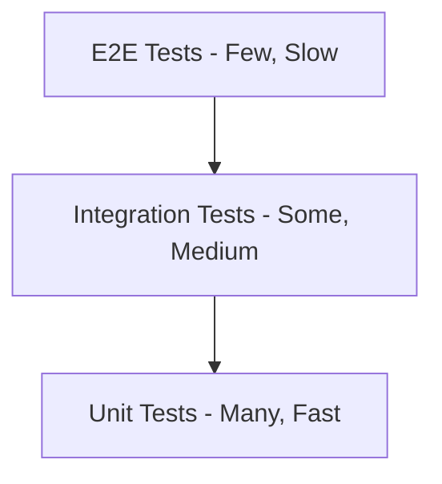
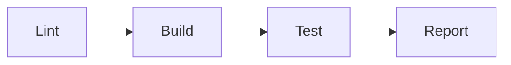

# LUCID Development Philosophy

> **Project:** AT80  
> **Version:** 1.1  
> **Last Updated:** 2025-11-27  
> **Status:** Active

---

## Table of Contents

1. [L - Lean](#l---lean)
2. [U - User-First](#u---user-first)
3. [C - Contracted](#c---contracted)
4. [I - Immutable](#i---immutable)
5. [D - Driven](#d---driven)
6. [Development Workflow](#development-workflow)
7. [Code Quality Standards](#code-quality-standards)
8. [Testing Philosophy](#testing-philosophy)
9. [Documentation Requirements](#documentation-requirements)
10. [Version Control & CI/CD](#version-control--cicd)
11. [Security Considerations](#security-considerations)
12. [Feature Management](#feature-management)
13. [Quick Reference Checklist](#quick-reference-checklist)

---

## Core Principles

The **LUCID** philosophy guides all development in this repository.

### L - Lean

> **"Simplicity is the ultimate sophistication."**

**Key Concepts:**
- **KISS (Keep It Simple, Stupid):** Avoid over-engineering. If it's hard to explain, it's too complex.
- **DRY (Don't Repeat Yourself):** Every piece of knowledge must have a single representation.
- **Max 3 Indents:** No method should exceed 3 levels of indentation. Flatten logic with guard clauses.

**Einstein's Paraphrase:**
> *"Make everything as simple as possible, but not simpler."*

---

### U - User-First

> **"Design the interface before the implementation."**

The user interface drives the architecture—not the other way around.

**Workflow:**
1. **Wireframe/Mockup** — Sketch the UI (even as ASCII or basic shell)
2. **Define Interactions** — How does the user navigate and trigger actions?
3. **Derive Data Contracts** — What data does the UI need?
4. **Design API/Services** — Build services to serve the UI requirements
5. **Implement Backend** — Backend exists to serve the UI contract

**Inclusive by Default (Accessibility/A11y):**
- **WCAG 2.1 AA:** All interfaces must meet minimum contrast and readability standards.
- **Keyboard First:** Every action must be performable without a mouse.
- **Semantic Structure:** Use proper hierarchy (headings, lists) to support screen readers.

**Rationale:**
- Early stakeholder feedback before heavy investment
- Parallel development (mock APIs enable frontend work)
- Better user experience outcomes

---

### C - Contracted

> **"Document what functions expect and what they guarantee."**

**Design by Contract:**
- **Preconditions:** What must be true BEFORE calling (e.g., `input > 0`).
- **Postconditions:** What will be true AFTER execution (e.g., `return_value is not None`).
- **Docstrings:** Every function must document these contracts explicitly.

**Example:**
```python
def calculate_discount(price: float, rate: float) -> float:
    """
    Calculate discount amount.
    
    Preconditions:
        - price >= 0
        - 0.0 <= rate <= 1.0
    
    Postconditions:
        - Returns value >= 0
        - Returns value <= price
    """
    if price < 0 or not (0 <= rate <= 1):
        raise ValueError("Contract violation")
    return price * rate
```

---

### I - Immutable

> **"Classes define boundaries; functions inside them should be pure."**

**Object-Oriented Structure, Functional Internals:**
- **Pure Functions:** Same input → same output, no side effects.
- **Immutability:** Prefer returning new objects over mutating state.
- **Declarative:** Express *what*, not *how* (use `map`, `filter` over loops).

**Why?**
- Easier to test (no hidden state).
- Thread-safe by default.
- Predictable behavior.

---

### D - Driven

> **"Driven by Tests and Data."**

**1. Test-Driven (TDD):**
- **Red:** Write a failing test first.
- **Green:** Write minimal code to pass.
- **Refactor:** Improve code while keeping tests green.
- **Rule:** NO implementation code exists without a FAILING TEST first.

**2. Data-Driven:**
- **No Hardcoding:** All variables come from data sources (Config, Env, DB).
- **Configuration Hierarchy:** CLI > Env > Config > Constants.
- **Magic Numbers:** Forbidden. Use named constants.

**3. Observability-Driven:**
- **Telemetry over Logs:** Prefer structured events (Metrics, Traces) over plain text logs.
- **Zero-Config Instrumentation:** Applications should emit health and performance metrics by default.
- **Correlation:** Every request/action must have a Trace ID to track it across boundaries.

---

## Development Workflow

### Session Workflow



### UI-First Development Cycle (TDD)

> **"Tests are written BEFORE implementation code. Always."**



**The Golden Rule:**
```
NO implementation code exists without a failing test first.
```

---

## Code Quality Standards

### Function/Method Rules

| Rule | Requirement |
|------|-------------|
| Length | ≤ 20 lines preferred, ≤ 40 max |
| Indentation | ≤ 3 levels deep |
| Parameters | ≤ 4 parameters (use objects for more) |
| Cyclomatic Complexity | ≤ 10 |
| Single Responsibility | Does ONE thing |

### Naming Conventions

| Element | Convention | Example |
|---------|------------|---------|
| Classes | PascalCase, noun | `OrderProcessor` |
| Functions | snake_case, verb | `calculate_total()` |
| Private | Leading underscore | `_validate_input()` |
| Constants | SCREAMING_SNAKE | `MAX_RETRY_COUNT` |
| Booleans | is_, has_, can_ | `is_valid`, `has_items` |

### File Naming Conventions

| Case Style | Usage | Example |
|------------|-------|---------|
| **SCREAMING_SNAKE** | **Project-Agnostic / Standard Artifacts / Templates**<br>Files that exist in *every* project (e.g., README) or are reusable templates. | `README.md`, `LICENSE`, `TEMPLATE.md`, `LUCID/` |
| **snake_case** | **Project-Specific Source & Docs**<br>Implementation files, specific guides, and documentation unique to this project's domain. | `card_scraper.py`, `analytics_guide.md`, `deck_building_rules.txt` |
| **PascalCase** | **Class Files (Optional)**<br>Some languages/frameworks prefer this for class files. | `OrderProcessor.cs` |


### Import Organization

```python
# 1. Standard library
import os
import sys
from pathlib import Path

# 2. Third-party packages
import requests
from pydantic import BaseModel

# 3. Local application
from features.analytics import Analyzer
from features.utils import helpers
```

---

## Testing Philosophy

### ⚠️ MANDATORY: Tests Before Code

> **"No implementation code is written until a failing test exists for it."**

This is non-negotiable. The sequence is always:
1. Write a test that describes the expected behavior
2. Run the test — it MUST fail (Red)
3. Write the minimum code to pass the test (Green)
4. Refactor while keeping tests green
5. Repeat

**If you find yourself writing code before tests, STOP and write the test first.**

### Coverage Target: 99.9%

> **"Untested code is broken code."**

**Coverage Requirements:**
| Code Type | Minimum Coverage |
|-----------|------------------|
| Business Logic | 100% |
| API Endpoints | 100% |
| Data Access | 100% |
| Utilities | 99% |
| UI Components | 95% |
| Config/Setup | 90% |

### Test-Driven Development (TDD)



### Test Structure (Arrange-Act-Assert)

```python
def test_calculate_discount_applies_percentage():
    # Arrange
    price = 100.0
    discount_percentage = 25.0
    
    # Act
    result = calculate_discount(price, discount_percentage)
    
    # Assert
    assert result == 75.0
```

### Testing Pyramid



### Test File Organization

```
tests/
├── unit/
│   ├── test_calculator.py
│   └── test_validator.py
├── integration/
│   ├── test_database_operations.py
│   └── test_api_endpoints.py
├── e2e/
│   └── test_full_workflows.py
├── fixtures/
│   └── sample_data.py
└── conftest.py
```

---

## Documentation Requirements

### Class Documentation Standards

> **"Every class has a docstring explaining its purpose and responsibilities."**

**Required Elements:**
```python
class OrderProcessor:
    """
    Handles order validation, pricing, and submission.
    
    Responsibilities:
        - Validate order structure and contents
        - Calculate totals including tax and discounts
        - Submit orders to fulfillment system
    
    Collaborators:
        - InventoryService: stock availability checks
        - PricingEngine: discount calculations
        - FulfillmentGateway: order submission
    
    Invariants:
        - Orders are immutable once submitted
        - All monetary values in cents (integers)
    
    Example:
        >>> processor = OrderProcessor(inventory, pricing)
        >>> result = processor.submit(order)
    """
```

### Architecture Decision Records (ADRs)

> **"Record every significant architectural decision."**

**Location:** `docs/development/decisions/`

**Filename:** `ADR-NNNN-short-title.md`

**Template:**

```markdown
# ADR-NNNN: [Short Title]

## Status
[Proposed | Accepted | Deprecated | Superseded by ADR-XXXX]

## Date
YYYY-MM-DD

## Context
What is the issue or requirement driving this decision?

## Decision
What is the change we're making?

## Alternatives Considered
1. **Alternative A:** Description
   - Pros: ...
   - Cons: ...
2. **Alternative B:** Description
   - Pros: ...
   - Cons: ...

## Consequences
### Positive
- ...

### Negative
- ...

### Neutral
- ...

## Related
- ADR-XXXX: Related decision
- Issue #123: Related issue
```

### Helper Programs/Processes Documentation

**Location:** `docs/development/helpers/`

For any helper script, tool, or process:

```markdown
# Helper: [Name]

## Purpose
What does this helper do?

## Usage
```bash
python scripts/helper_name.py --option value
```

## Inputs
- `--option`: Description of option

## Outputs
- Description of what is produced

## Dependencies
- Required packages or tools

## Maintenance
- Who maintains this?
- When should it be run?
```

### Problem Investigations

> **"Don't just fix it; understand it."**

**Location:** `docs/development/investigations/`

**Filename:** `INV-NNNN-short-title.md`

When a significant bug, outage, or unexpected behavior occurs, we perform a **Problem Investigation** (often called a Postmortem or RCA). This is a blameless document focused on understanding the *systemic* cause of the failure to prevent recurrence.

**Key Principles:**
1.  **Blameless:** Focus on process and system failures, not human error.
2.  **Root Cause:** Use the "5 Whys" technique to find the underlying cause.
3.  **Actionable:** Every investigation must result in concrete corrective actions (tests, fixes, docs).

**Template:**

```markdown
# INV-NNNN: [Short Title]

## 1. Problem Summary
Brief description of the issue, impact, and severity.

## 2. Root Cause Analysis (The 5 Whys)
1. Why? ...
2. Why? ...
3. Why? ...
4. Why? ...
5. Why? [Root Cause]

## 3. Corrective Actions
- [ ] Fix the immediate bug
- [ ] Add a regression test (The Golden Rule)
- [ ] Update documentation/process
```

---

## Version Control & CI/CD

### Git Integration
- **Mandatory Pre-commit Hooks:** All projects must use `pre-commit` to enforce style and run tests before pushing.
  - **Formatting:** `black` (Python)
  - **Testing:** Run unit tests locally (`python -m unittest discover -v tests`)

### Commit Standards
- **Format:** `PROJECT.NNNN: <type>(<scope>): <subject>`
  - `PROJECT`: Project code (e.g., AT80)
  - `NNNN`: Incrementing number (0001, 0002...)
  - `type`: feat, fix, docs, style, refactor, test, chore
- **Length Limits:**
  - **Header:** Max 80 characters
  - **Body:** Max 200 characters (optional)
- **Automation:** Use the project CLI (`python scripts/cli.py -G --commit "msg"`) to handle numbering and formatting automatically.

### Branching Strategy
- **Main Branch:** `main` (Protected, always deployable)
- **Feature Branches:** `feat/description` or `fix/issue-id`
- **Merge Strategy:** Squash and merge (preserves linear history)

### CI Pipeline

**Pipeline Stages:**



**WIP Skip Mechanism:**

Commits prefixed with `[WIP]` or type `wip:` skip test stage:

```yaml
# .github/workflows/ci.yml
jobs:
  test:
    if: "!contains(github.event.head_commit.message, '[WIP]') && !startsWith(github.event.head_commit.message, 'wip:')"
```

**Pipeline Features:**
- Automated linting (ruff, black)
- Unit test execution
- Integration test execution
- Coverage reporting (fail if < 99%)
- Security scanning
- Dependency vulnerability check

---

## Security Considerations

*Based on Australian Cyber Security Centre (ACSC) ISM Guidelines*

### Secure Development Practices

| Control | Requirement |
|---------|-------------|
| ISM-0400 | Separate dev/test/staging/production environments |
| ISM-1419 | Development only in development environments |
| ISM-2043 | Software architected for readability and maintainability |
| ISM-2040 | Secure programming practices for chosen language |
| ISM-2033 | Security requirements documented throughout SDLC |

### Input Validation

> **"Never trust input. Validate everything."**

```python
def process_user_input(data: str) -> ProcessedData:
    """
    Preconditions:
        - data is not None
        - data length <= MAX_INPUT_LENGTH
    
    Postconditions:
        - Returns sanitized, validated data
        - All special characters escaped
    """
    if data is None:
        raise ValueError("Input cannot be None")
    if len(data) > MAX_INPUT_LENGTH:
        raise ValueError(f"Input exceeds maximum length of {MAX_INPUT_LENGTH}")
    
    sanitized = _sanitize_input(data)
    validated = _validate_format(sanitized)
    return validated
```

### Secrets Management

**NEVER commit:**
- API keys
- Passwords
- Private keys
- Connection strings with credentials

**Use instead:**
- Environment variables
- `.env` files (gitignored)
- Secrets managers (for production)

```bash
# .gitignore
.env
.env.*
secrets/
*.key
*.pem
```

### Dependency Security

- Pin dependency versions
- Regular vulnerability scanning
- Use trusted sources only
- Review dependency changelogs before updating
- **SBOM:** Generate a Software Bill of Materials for every release.
- **Supply Chain:** Verify signatures of all third-party packages.

---

## Ethical Responsibility

> **"Code is power. Use it responsibly."**

### 1. Sustainability (Genuine Green IT)
We follow the **Green Software Foundation** principles.

*   **Carbon Awareness (Temporal Shifting):**
    *   Run heavy batch jobs (e.g., scraping, training) when the local grid is "green" (low carbon intensity).
    *   Use APIs like the Carbon Aware SDK to determine optimal runtimes.
*   **Network Efficiency:**
    *   **Data is Energy:** Every byte transferred consumes electricity at every router and switch.
    *   **Aggressive Caching:** Never re-download data. Use local caches (`data/*.json`) effectively.
    *   **Headless Scraping:** Block images/fonts/media when scraping text data.
*   **Hardware Efficiency (Embodied Carbon):**
    *   **Support Older Hardware:** Our TUI (Text UI) is a deliberate choice to run on low-spec/old machines, extending their lifespan.
    *   **Amortization:** Extending a device's life by 1 year significantly reduces its annual carbon footprint.

### 2. Inclusivity
- **Language:** Use gender-neutral and inclusive terminology (e.g., `allowlist` vs `whitelist`, `primary/replica` vs `master/slave`).
- **Representation:** Ensure demo data and examples represent diverse user groups.

### 3. Data Minimization
- **Collect Only What is Needed:** Do not store user data "just in case".
- **Retention:** Define and enforce automatic deletion policies for old data.

#### Data Retention Policy (Gold Standard)

> **"We retain data only as long as it serves a defined purpose. Expiration is automated."**

| Data Category | Retention Period | Implementation Strategy | Purpose |
| :--- | :--- | :--- | :--- |
| **Session / Auth Tokens** | **24 Hours** | **Redis/DB TTL** | Security, Active Session Management |
| **Raw Application Logs** | **30 Days** | **Log Rotation / Lifecycle** | Debugging, Incident Response |
| **Audit / Security Logs** | **1 Year** | **Archive Storage** | Compliance, Forensics (NIST/PCI) |
| **User PII (Deleted)** | **30 Days** | **Soft Delete + Hard Delete Job** | Recovery Grace Period |
| **Analytics (Raw)** | **90 Days** | **DB Partitioning / TTL** | Granular Analysis |

**Implementation Rules:**
1.  **Automate:** Never rely on manual cleanup. Use TTL indexes or Lifecycle policies.
2.  **The Reaper Pattern:** For relational databases, run a daily job to hard-delete "soft deleted" records older than the grace period.
3.  **Anonymize:** If history is needed (e.g., Sales), scrub PII columns instead of deleting the row.

---

## Feature Management

> **"Plan the work, then work the plan."**

### Agile & LUCID Alignment

Our Agile practices are derived directly from our core principles:

| Agile Practice | LUCID Principle | Why? |
| :--- | :--- | :--- |
| **Lean Sizing** | **L - Lean** | Eliminates waste (debate) and focuses on flow. |
| **Vertical Slicing** | **U - User-First** | Delivers working value to the user immediately. |
| **INVEST Criteria** | **C - Contracted** | Defines a clear contract for what a "Story" is. |
| **Spikes** | **D - Driven** | Decisions are driven by data/research, not guesses. |

### Creating User Stories (The 3 C's)

We follow Ron Jeffries' **3 C's** model to ensure stories are conversations, not just requirements.

#### 1. Card (The Placeholder)
The written story must follow the standard template to ensure user focus.

> **As a** `<role>`  
> **I want** `<feature>`  
> **So that** `<benefit>`

*   **Role:** Be specific (e.g., "Competitive Player" not just "User").
*   **Feature:** The action they want to take.
*   **Benefit:** The *value* they get. This is the most important part.

#### 2. Conversation (The Understanding)
The card is just a promise to talk.
*   **Discuss:** Developers and Product Owner discuss the story.
*   **Clarify:** Ask "What about error X?" or "Does this include Y?".
*   **Slice:** If the conversation reveals complexity, slice the story using **SPIDR**.

#### 3. Confirmation (The Contract)
We use **Gherkin Syntax** (Given/When/Then) for Acceptance Criteria. This aligns with our **Driven** principle (TDD/BDD).

**Template:**
```gherkin
Scenario: [Scenario Name]
  Given [Precondition: State of the system]
  When [Action: User performs an action]
  Then [Outcome: Observable result]
```

**Example:**
```gherkin
Scenario: Successful Login
  Given I am on the login screen
  And I have a valid account
  When I enter my username and password
  Then I should be redirected to the dashboard
  And I should see a "Welcome back" message
```

### Agile Estimation (The "Lean" Scale)

> **"Estimates are waste. Reduce them."**

We do not use Fibonacci (1, 2, 3, 5...). We use a **Lean Sizing** approach to minimize debate and maximize flow.

**The 3 Valid Sizes:**

1.  **1 Point (Standard):**
    *   **Definition:** A task that is clear, small, and can be completed in one sitting or day.
    *   **Action:** Do it.

2.  **Too Big (Break it down):**
    *   **Definition:** Anything larger than a "1".
    *   **Action:** Do not estimate. **Slice it** into smaller stories until they are all "1s".

3.  **Don't Know (Spike):**
    *   **Definition:** Requirements are vague or technical approach is unknown.
    *   **Action:** Create a **Spike** (time-boxed research task) to gain knowledge.

**Velocity:**
- We measure **Throughput** (Items completed per week), not "Points".
- Since all items are roughly size "1", the count is a reliable metric.

### Forecasting & Tracking (No Burndowns)

> **"Stop trying to predict the future with guesses. Use data."**

We explicitly **REJECT** Burndown Charts. They hide scope creep and ignore flow.
Instead, we use **Flow Metrics** to track progress and forecast.

#### 1. Tracking: The Burnup Chart
**Purpose:** Visualize progress and scope creep.
*   **Line A (Total Scope):** Total number of stories in the backlog.
*   **Line B (Completed):** Number of stories finished.
*   **Insight:** If the finish date moves, we can instantly see if it's because we are slow (Line B flat) or because scope increased (Line A jumped).

#### 2. Forecasting: Monte Carlo Simulation
**Purpose:** Predict completion dates with confidence intervals.
*   **Input:** Our historical **Throughput** (items finished per week).
*   **Process:** Simulate the remaining backlog 10,000 times using random samples of our past performance.
*   **Output:** "We have an **85% chance** of finishing by [Date]."

#### 3. Risk Management: Cycle Time Scatterplot
**Purpose:** Identify pain points and "stuck" work.
*   **Plot:** Every completed task is a dot (Y = Days taken, X = Date finished).
*   **85th Percentile Line:** The "Service Level Expectation" (SLE). e.g., "85% of our tasks finish in 4 days."
*   **Risk Signal:** Any *active* task that crosses this line is "aging" and is a red-flag risk.

---

## Architectural Frameworks

### Why NOT TOGAF?

We explicitly **REJECT** the TOGAF (The Open Group Architecture Framework) model for this project.

| TOGAF Principle | LUCID Conflict | Reason |
| :--- | :--- | :--- |
| **Heavy Documentation** | **L - Lean** | TOGAF requires extensive artifacts (Architecture Definition Documents) which are "waste" in a Lean system. |
| **Top-Down Design** | **U - User-First** | TOGAF defines architecture before implementation. LUCID lets the UI/User needs drive the architecture. |
| **Enterprise Scope** | **D - Driven** | TOGAF is for coordinating departments. AT80 is a single application. |

### The LUCID Architecture Stack

Instead of TOGAF, we use lightweight, code-centric frameworks that align with our principles.

#### 1. The C4 Model (For Diagrams)
**Aligns with: L - Lean**
We use the **C4 Model** to visualize architecture. It is hierarchical and zoomable, like Google Maps for code.
1.  **Context:** System + Users (High level).
2.  **Containers:** Applications/Databases (Deployable units).
3.  **Components:** Modules/Classes (Code structure).
4.  **Code:** The actual code (No diagrams needed, read the code).

#### 2. Clean Architecture (For Code Structure)
**Aligns with: I - Immutable & C - Contracted**
We structure our code to keep business logic pure and independent of frameworks.

*   **Entities (Core):** Pure Python objects (e.g., `Card`, `Deck`). No dependencies.
*   **Use Cases (Features):** Application logic (e.g., `BuildDeck`, `AnalyzeProbabilities`).
*   **Interface Adapters:** TUI, CLI, Scrapers.
*   **Frameworks:** Database, File System, External APIs.

**The Dependency Rule:** Source code dependencies can only point **inwards**. Nothing in an inner circle can know anything at all about something in an outer circle.

### Handling "Don't Know" (Spikes)

When a task is "Don't Know", we create a **Spike**.

**Rules for Spikes:**
1.  **Time-Boxed:** Strict limit (e.g., 1 hour, 4 hours). Stop when time is up.
2.  **Throwaway Code:** Do not write production code. Write scripts to learn.
3.  **Specific Question:** Must answer *one* specific question (e.g., "Can library X parse our PDF format?").

**Spike Output Template:**
```markdown
# Spike: [Topic]

## Question
What specific question are we trying to answer?

## Time Box
[X] Hours

## Findings
- What did we learn?
- Does the library work?
- What are the risks?

## Decision
- [ ] Go ahead (Create implementation stories)
- [ ] Abandon approach (Try alternative)
- [ ] Need more research (New Spike)

## Resulting Stories (All size "1")
1. [ ] Setup library X
2. [ ] Implement basic parsing
3. [ ] Handle error case Y
```

### Handling "Too Big" (Slicing)

When a task is "Too Big", we **Slice** it. Do not start coding until it is sliced.

**The Hamburger Method (Vertical Slicing):**
We visualize the feature as a burger. Instead of eating the bun (Database) then the meat (API) then the lettuce (UI) separately, we take a **vertical bite** through all layers.

**The SPIDR Method (How to Slice):**
Use these 5 patterns to find the vertical slice.

| Pattern | Strategy | "Too Big" Example | Sliced "1 Point" Stories |
| :--- | :--- | :--- | :--- |
| **S**pikes | **Research First** | "Integrate unknown API" | 1. Spike: Verify authentication works<br>2. Implement happy path |
| **P**aths | **Happy/Sad Path** | "User Login" | 1. Login with valid credentials<br>2. Login with wrong password<br>3. "Forgot Password" link |
| **I**nterfaces | **Hardcoded/Simple** | "Leaderboard" | 1. Display hardcoded list of 3 users<br>2. Fetch list from DB (no sorting)<br>3. Add sorting logic |
| **D**ata | **By Data Type** | "Import Deck Lists" | 1. Import PTCGL format (Standard)<br>2. Import Plain Text<br>3. Handle Invalid IDs |
| **R**ules | **Relaxed Rules** | "Deck Validation" | 1. Allow any 20 cards<br>2. Enforce "Max 2 copies" rule<br>3. Enforce "Type" restrictions |

**Validation (INVEST):**
Before starting, check if the story is:
- **I**ndependent (Can be done alone)
- **N**egotiable (Open to discussion)
- **V**aluable (Delivers value to user)
- **E**stimable (Clear enough to size)
- **S**mall (Size "1")
- **T**estable (Has clear pass/fail criteria)

### 1. Internal Feature Roadmap

The roadmap is a living document that tracks the evolution of the project. It is divided into three horizons:

#### Horizon 1: Current (Next 2 Weeks)
*Active development. High certainty.*
- [ ] **Feature A**: Description...
- [ ] **Feature B**: Description...

#### Horizon 2: Near Term (Next 1-2 Months)
*Planned but subject to change. Medium certainty.*
- **Feature C**: Concept...
- **Feature D**: Concept...

#### Horizon 3: Future (3+ Months)
*Ideas and strategic goals. Low certainty.*
- **Idea E**: ...

### 2. Definition of Done (DoD)

A feature is not "Done" until it meets **all** of the following criteria:

#### Code Quality
- [ ] **Linting**: Code passes all linter checks (`ruff`, `black`, `mypy`).
- [ ] **Formatting**: Code is formatted according to project standards.
- [ ] **Clean Code**: No commented-out code, debug prints, or TODOs left in the implementation.

#### Testing
- [ ] **Unit Tests**: All new logic has corresponding unit tests.
- [ ] **Integration Tests**: Critical paths are verified with integration tests.
- [ ] **Pass Rate**: 100% of tests pass locally and in CI.

#### Documentation
- [ ] **Docstrings**: All public functions and classes have Google-style docstrings.
- [ ] **README**: Feature is documented in the relevant `README.md` or user guide.
- [ ] **Changelog**: Entry added to `CHANGELOG.md` (if applicable).

#### Functionality
- [ ] **Requirements Met**: Fulfills the original user request/ticket.
- [ ] **No Regressions**: Does not break existing features.
- [ ] **UI/UX**: Interface is responsive and follows the "UI-First" principle.

### 3. Scope Creep Prevention

**"Scope Creep"** is the uncontrolled growth of a project's scope.

#### Detection
- **"While you're at it..."**: A warning phrase indicating a request outside the original plan.
- **"Just one small thing..."**: Often leads to a cascade of changes.
- **New Dependencies**: Adding libraries for a minor feature.

#### Prevention Protocol
1.  **Refer to the Ticket**: Does this task align with the written requirements?
2.  **The "Later" List**: If a good idea comes up, add it to the **Backlog** or **Roadmap** instead of doing it now.
3.  **Strict MVP**: Build the Minimum Viable Product first. Polish later.
4.  **Atomic Commits**: Keep changes focused. If a commit message needs "and", it might be too much.

#### Handling Scope Changes
If a scope change is **necessary**:
1.  **Acknowledge it**: "This is outside the original plan."
2.  **Estimate it**: "This will add X hours/days."
3.  **Trade-off**: "To do this now, we must delay Y."
4.  **Document it**: Update the roadmap/ticket.

---

## Quick Reference Checklist

### Before Writing ANY Implementation Code

- [ ] UI/Interface designed or mocked
- [ ] Data contracts defined
- [ ] **⚠️ TESTS WRITTEN FIRST** (they should fail)
- [ ] ADR created if architectural decision

### While Writing Code

- [ ] Test is failing for the feature you're implementing
- [ ] Maximum 3 levels of indentation
- [ ] No magic numbers/strings
- [ ] Pre/postconditions documented
- [ ] Class has docstring
- [ ] Functions are small (≤ 20 lines)
- [ ] Pure functions where possible
- [ ] Test now passes

### Before Committing

- [ ] All tests pass
- [ ] Coverage ≥ 99%
- [ ] No linting errors
- [ ] Documentation updated
- [ ] Meaningful commit message

### End of Session

- [ ] Push to remote
- [ ] Use `[WIP]` if unfinished
- [ ] Update todo/issue tracker

---

## References

### Industry Standards
- [ACSC ISM Guidelines for Software Development](https://www.cyber.gov.au/business-government/asds-cyber-security-frameworks/ism/cybersecurity-guidelines/guidelines-for-software-development)
- [NIST Secure Software Development Framework (SSDF)](https://csrc.nist.gov/pubs/sp/800/218/final)
- [OWASP Secure Coding Practices](https://owasp.org/www-project-secure-coding-practices-quick-reference-guide/)

### Books & Papers
- *Clean Code* — Robert C. Martin
- *The Pragmatic Programmer* — Andy Hunt & Dave Thomas
- *Test-Driven Development by Example* — Kent Beck
- *Design by Contract* — Bertrand Meyer

### Tooling
- **Testing:** pytest, pytest-cov
- **Linting:** ruff, black, mypy
- **Security:** bandit, safety
- **CI/CD:** GitHub Actions

---

*This is a living document. Update as practices evolve.*
