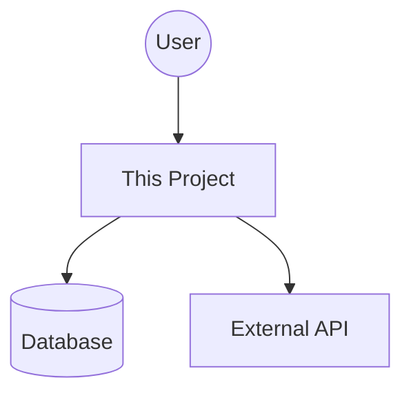

# Project Proposal: [Project Name]

> **Status:** [Draft | Proposed | Approved | Rejected]  
> **Owner:** [Name]  
> **Date:** YYYY-MM-DD

---

## 1. Executive Summary
> **The Elevator Pitch:**  
> [One or two sentences describing the project, who it's for, and the primary value it delivers.]

---

## 2. User-First Vision (U - User-First)

### The Problem
**What pain point are we solving?**
- [ ] Pain point 1
- [ ] Pain point 2

### The User Persona
**Who is this for?**
> **As a** [Role], **I want** [Goal], **So that** [Benefit].

### Market Analysis
**Does this already exist?**
*Investigation into existing solutions and why they don't fit.*
- **Competitor A:** [Why it's not enough]
- **Competitor B:** [Why it's not enough]

**Value Proposition:**
> **Unlike** [Competitor], **Our Solution** [Key Differentiator].

### The Solution (UI-First)
**How does the user interact with it?**
*Describe the interface before the implementation. ASCII art, wireframes, or descriptions.*

```text
+---------------------------------------+
|  [ Header / Navigation ]              |
|---------------------------------------|
|                                       |
|  [ Main Interaction Area ]            |
|                                       |
|  > User Input                         |
|  [ Action Button ]                    |
|                                       |
|---------------------------------------|
|  [ Output / Results ]                 |
+---------------------------------------+
```

---

## 3. Scope & Features

### In Scope (MVP)
**What are the "Must Haves"?**
- [ ] **Feature A:** Description
- [ ] **Feature B:** Description

### Out of Scope (For Now)
**What are we explicitly NOT doing yet?**
- [ ] Feature X
- [ ] Feature Y

### Key User Stories (The 3 C's)
| ID | Story | Acceptance Criteria (Gherkin) |
|----|-------|-------------------------------|
| 1 | As a user... | Given... When... Then... |
| 2 | As a user... | Given... When... Then... |

---

## 4. Technical Strategy (L - Lean, C - Contracted)

### Architecture (C4 Context)
*How does this fit into the existing system?*



### Data Contracts
*What are the key inputs and outputs?*

**Input Contract:**
- `param1`: Type (Constraints)
- `param2`: Type (Constraints)

**Output Contract:**
- Returns: Type (Guarantees)

### Tech Stack & Dependencies
- **Language:** [e.g., Python 3.12]
- **Key Libraries:** [e.g., pandas, textual]
- **Infrastructure:** [e.g., Local, Cloud]

---

## 5. Roadmap (Feature Management)

### Horizon 1: Foundation (Weeks 1-2)
- [ ] Setup project structure
- [ ] Implement core UI shell
- [ ] [Feature A]

### Horizon 2: Core Value (Weeks 3-4)
- [ ] [Feature B]
- [ ] [Feature C]

### Horizon 3: Polish & Expand (Month 2+)
- [ ] Optimization
- [ ] Advanced features

---

## 6. Risks & Unknowns (Spikes)

**What don't we know yet?**
*List areas where we need to run a Spike (time-boxed research).*

| Unknown | Risk Level | Proposed Spike |
|---------|------------|----------------|
| Can library X do Y? | High | Spike: Prototype X with Y |
| Performance of Z | Medium | Spike: Load test Z |

---

## 7. Success Metrics (D - Driven)

**How will we measure success?**
- [ ] **Metric 1:** Target Value
- [ ] **Metric 2:** Target Value
