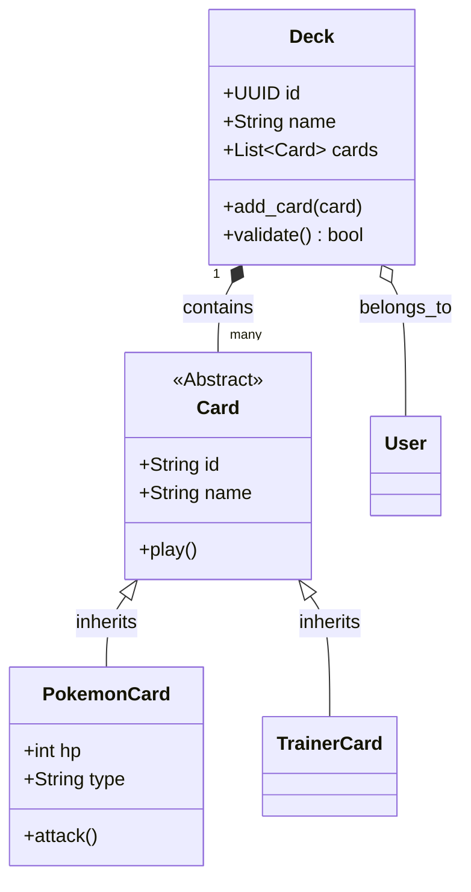
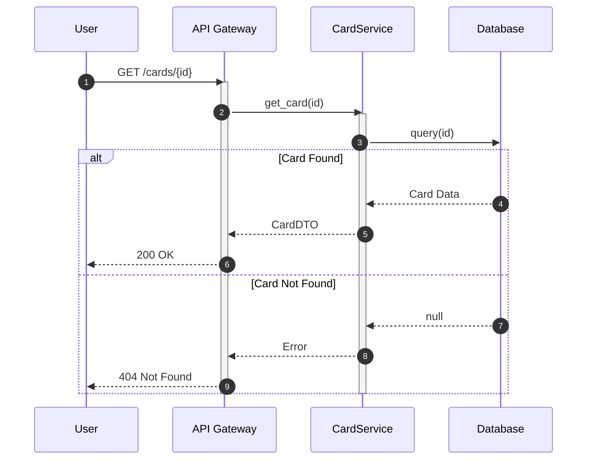
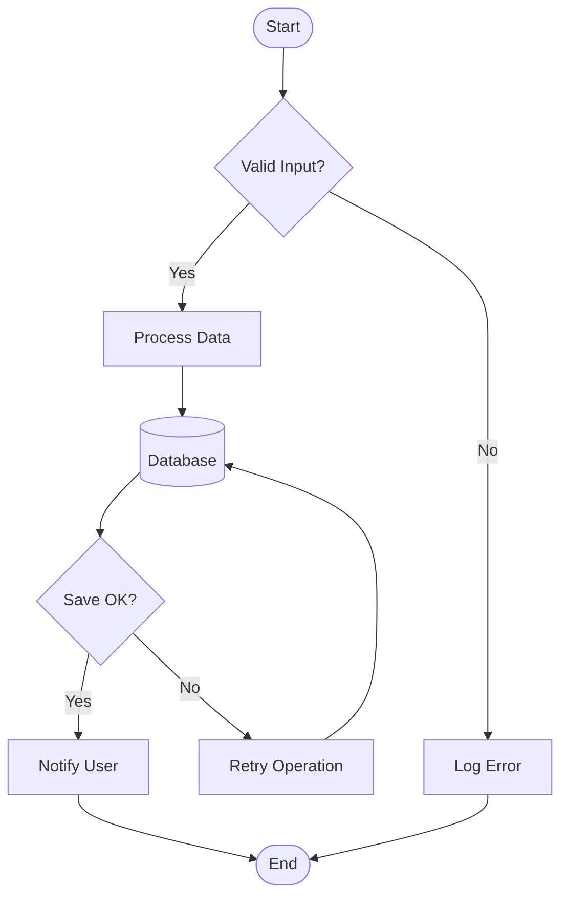
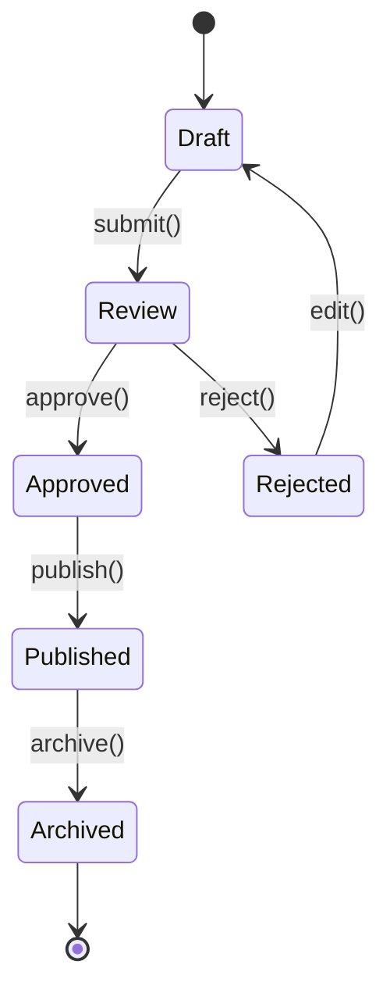
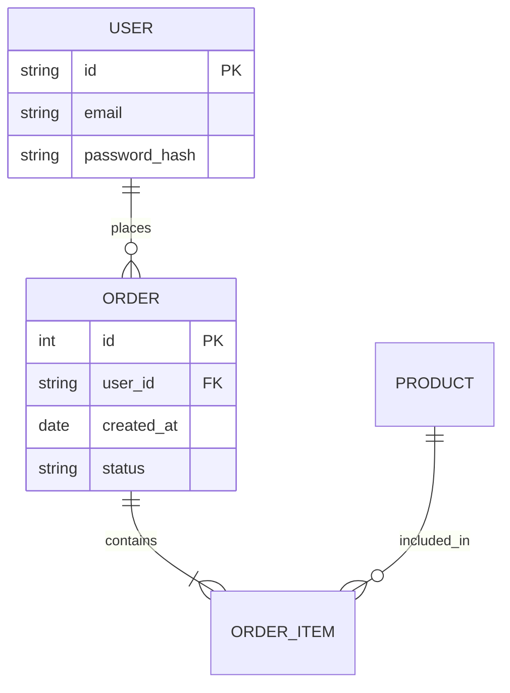

# Diagram Templates

> **Project:** [Project Name]  
> **Version:** 1.0  
> **Last Updated:** 2025-11-27  
> **Status:** Active

---

## Purpose

This document provides copy-paste templates for creating standard UML diagrams using **Mermaid.js**. Use these in your Feature READMEs and architectural documentation.

---

## 1. Class Diagram (Structure)

**Use for:** Showing class attributes, methods, and relationships.



**Source Code:**
````markdown

````

---

## 2. Sequence Diagram (Interactions)

**Use for:** Showing how objects interact over time to complete a task.



**Source Code:**
````markdown

````

---

## 3. Flowchart (Logic/Process)

**Use for:** Decision trees, algorithms, and workflows.



**Source Code:**
````markdown

````

---

## 4. State Diagram (Lifecycle)

**Use for:** Object lifecycles (e.g., Order status, Game state).



**Source Code:**
````markdown

````

---

## 5. Entity Relationship Diagram (Data)

**Use for:** Database schemas and data relationships.



**Source Code:**
````markdown

````
