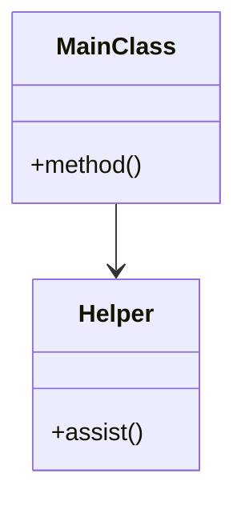
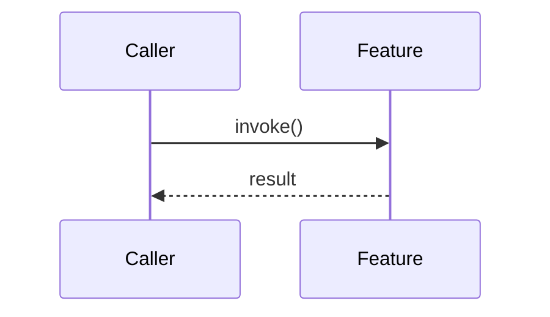

# Feature Name

> **Status:** [Experimental | Beta | Stable | Deprecated]  
> **Owner:** LF

---

## 1. Scope
**What this feature DOES:**
- [ ] Responsibility 1
- [ ] Responsibility 2
- [ ] Responsibility 3

**What this feature does NOT do:**
- [ ] Out of scope item 1
- [ ] Out of scope item 2

---

## 2. Value
**Why does this exist?**
> [One sentence value proposition]

**User Benefit:**
- Benefit 1
- Benefit 2

---

## 3. Architecture

### Class Structure
<!-- Replace with actual class diagram -->

### Data Flow / Sequence
<!-- Replace with actual sequence diagram -->

---

## 4. Dependencies

### Internal (Coupling)
| Feature | Direction | Reason |
|---------|-----------|--------|
| `features/auth` | Incoming | Uses User model |
| `features/db` | Outgoing | Persists data |

### External (Libraries)
- `pandas` (Data processing)
- `requests` (HTTP calls)

---

## 5. Investigations & Decisions
- [ADR-000X: Decision Title](../../docs/development/decisions/ADR-000X-template.md)
- [INV-000X: Investigation Title](../../docs/development/investigations/INV-000X-template.md)

---

## 6. Metrics (The Fun Part)
<!-- AUTO-GENERATED: DO NOT EDIT MANUALLY -->
| Metric | Value |
|--------|-------|
| **Files** | 0 |
| **Lines of Code** | 0 |
| **Characters** | 0 |
| **Libraries Used** | 0 |
<!-- END AUTO-GENERATED -->
